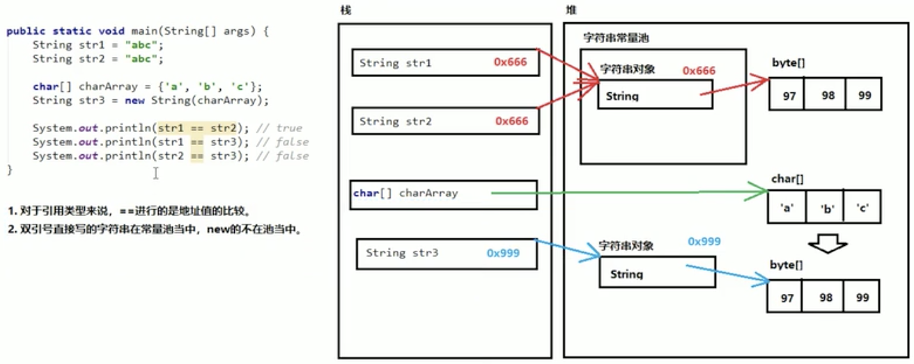

API(Application Programming Interface)，应用程序编程接口。Java API是一本程序员的字典 我们使用的类的说明文档。这些类将底层的代码实现封装了起来，我们不需要关心这些类是如何实现的，只需要学 习这些类如何使用即可。所以我们可以通过查询API的方式，来学习Java提供的类，并得知如何使用它们。JDK提供的类也是在一个个的包中。

- [Scanner类](#Scanner)
- [Random类](#Random)
- [ArrayList类](#ArrayList)
[](#)
[](#)
[](#)

### 引用数据类型使用步骤

1.导包

在类的所有代码之前导包，引入要使用的数据类型，java.lang包下的所有类无需导入。 
```
import 包名.类名;
```    
2.创建对象

使用该类的构造方法，创建一个该类的对象。
```
数据类型 变量名 = new 数据类型(参数列表);
```
3.调用方法

调用该类的成员方法，完成指定功能，格式。
```
变量名.方法名();
```

### Scanner

能够解析基本类型和字符串的简单文本扫描器。

比较常用的是：实现键盘输入数据到程序中。

```java
//1导包
import java.util.Scanner;

public class Demo01Scanner {
    public static void main(String[] args) {
        //2创建,System.in表示从键盘输入
        Scanner sc = new Scanner(System.in);

        //3调用方法
        //获取键盘输入的一个int数字
        int num = sc.nextInt();
        System.out.println("输入的int数字是："+num);

        //获取键盘输入的一个字符串
        String str = sc.next();
        System.out.println("输入的字符串是："+str);
    }
}
```
### Random

```java
//导包
import java.util.Random;

public class Demo01Random {
    public static void main(String[] args) {
        //创建
        Random r = new Random();
        //使用
        int num1 = r.nextInt();//范围是int所有范围
        System.out.println("随机数是" + num1);
    }
}
```
构造方法
```
Random()
创建一个新的随机数生成器。

Random(long seed)
使用单个long种子创建一个新的随机数生成器。
```
成员方法
```
nextInt()
从这个随机数生成器的序列返回下一个伪随机、均匀分布的整数值。

nextInt(int bound)
返回从该随机数生成器的序列中提取的、介于[0,bound)的伪随机、均匀分布的整数值。bound必须为正整数
```
**ex**:获取1-n之间的随机数，包含n
```java
    public static void main(String[] args) {
        randomN(new Scanner(System.in).nextInt());
    }

    private static void randomN(int n){
        Random r = new Random();
        int res;
        for (int i = 0; i < 100; i++) {
            res = r.nextInt(n)+1;//如果把+1写在里面，那么范围包括了0，不符合题目要求
            System.out.println("随机数字是"+res);
        }
    }
```
**ex**:猜数字，范围在1-100。**
```java
import java.util.Random;
import java.util.Scanner;

public class Demo01Random {
    public static void main(String[] args) {
        Random r = new Random();
        int randomNum = r.nextInt(100)+1;//生成一个随机数作为答案
        guessNum(randomNum);
    }

    private static void guessNum(int randomNum){
        int guess;
        Scanner sc = new Scanner(System.in);
        System.out.println("你一共能猜10次。请输入你要猜的数字：");
        int count=0;
        while(true){
            count++;
            guess=sc.nextInt();
            if(guess==randomNum){
                System.out.println("正确答案为："+ randomNum);
                System.out.println("你猜对了");
                break;
            }
            else if(guess>randomNum){
                System.out.println("猜大了");
            }
            else{
                System.out.println("猜小了");
            }
            if(count==10){
                System.out.println("你已用完十次机会，游戏失败");
                break;
            }
        }
    }
}
```
### ArrayList

对象数组可以存储对象数据，但数组的长度是固定的，无法适应数据变化的需求。Java提供了另一个容器java.util.ArrayList集合类,让我们可以更便捷的存储和操作对象数据。

ArrayList是List接口的大小可变数组的实现。ArrayList是泛型集合，也就是装在集合中的元素都是统一的某种引用类型。泛型只能是引用类型，不能是基本类型。

#### 构造方法
```
ArrayList()构造一个初始容量为10的空列表。

ArrayList(int initialCapacity)构造一个具有指定初始容量的空列表。

```
#### 创建ArrayList集合：
```
ArrayList<String>  list = new ArrayList<>();
从jdk7开始，右侧尖括号内部可以不写内容，但是尖括号本身还是要写的。
```
直接打印ArrayList集合，得到的不是地址而是内容。如果内容为空，得到的是空的中括号[]。

#### 常用的成员方法

添加元素
```
public boolean add(E e)将指定的元素添加到列表的尾部，参数的类型和泛型一致,
返回值表示添加是否成功。对于ArrayList来说，添加是一定成功的，所以返回值可以不用。
但对于其他集合来说，添加动作不一定成功。
    boolean success = list.add("first");
    System.out.println("添加是否成功"+ success);

public void add(int index, E element)将指定的元素插入到列表的指定位置，参数的类型和泛型一致。
```
获取元素
```
public E get(int index)获取列表中指定位置的元素，参数是索引编号，返回值是对应位置的元素。
```
删除元素
```
public E remove(int index)删除列表中指定位置的元素，参数是索引编号，返回值是被删的元素。
```
集合的长度
```
public int size()返回列表中元素个数。
```

#### 遍历ArrayList集合
```java
    for (int i = 0; i < list.size(); i++) {
        System.out.println(list.get(i));
    }
```

#### ArrayList集合存储基本类型数据

集合里保存的是地址值，但是基本类型的数据没有地址值。如果希望向ArrayList当中存储基本类型，必须存储基本类型对应的包装类。 
```
基本类型    包装类（引用类型，包装类都位于java.lang包下）
byte        Byte
short       Short
int         Integer     【特殊】
long        Long
float       Float
double      Double
char        Character   【特殊】
boolean     Boolean

从JDK 1.5+开始，支持自动装箱、自动拆箱。

自动装箱：基本类型 自动变成--> 包装类型
自动拆箱：包装类型 自动变成--> 基本类型
```

### 字符串

java.lang.String类代表字符串。

Java程序中的所有字符串字面值（如 "abc" ）都作为此类的实例实现。也就是说程序当中所有的双引号字符串，都是String类的对象。

**字符串的特点：**
1. 字符串的内容永不可变。【重点】
```java
String s1 = "abc";
s1 += "d";
System.out.println(s1); // "abcd"
// 内存中有"abc"，"abcd"两个对象，s1从指向"abc"，改变指向，指向了"abcd"。
```
2. 正是因为字符串不可改变，所以字符串是可以共享使用的。
```java
String s1 = "abc";
String s2 = "abc";
// 内存中只有一个"abc"对象被创建，同时被s1和s2共享。
```

3. 字符串效果上相当于是char[]字符数组，但是底层原理是byte[]字节数组。
```java
例如:
String str = "abc";
相当于:
char data[] = {'a', 'b', 'c'}; String str = new String(data); // String底层是靠字符数组实现的。
```

#### 创建字符串的方式

三种构造方法：
```
public String()：创建一个空白字符串，不含有任何内容。
public String(char[] array)：根据字符数组的内容，来创建对应的字符串。
public String(byte[] array)：根据字节数组的内容，来创建对应的字符串。
```
一种直接创建：
```
String str = "Hello"; // 右边直接用双引号
直接写上双引号，就是字符串对象
```
#### 字符串的常量池

程序当中直接写上的双引号字符串，就在字符串常量池中。

对于基本类型来说，==是进行数值的比较。

对于引用类型来说，==是进行【地址值】的比较。

双引号直接写的字符串在常量池中，new的不在池当中。

<div align="center"></img></div>

```java
public class Demo02StringPool {
    public static void main(String[] args) {
        String str1 = "abc";
        String str2 = "abc";

        char[] charArray = {'a', 'b', 'c'};
        String str3 = new String(charArray);
        /*右边会根据char数组创建一个byte数组，然后new一个String对象，指向新创建的byte数组。

        这个new的对象不在池子里。将new的String对象的地址存到str3中。
        */

        System.out.println(str1 == str2); // true
        System.out.println(str1 == str3); // false
        System.out.println(str2 == str3); // false
    }
}
```

#### 字符串的比较

```
public boolean equals(Object obj)：参数可以是任何对象，只有参数是一个字符串并且内容相同的才会给true；否则返回false。
```
注意事项：
1. 任何对象都能用Object进行接收。
2. equals方法具有对称性，也就是a.equals(b)和b.equals(a)效果一样。
3. 如果比较双方一个常量一个变量，推荐把常量字符串写在前面。
如果变量为null，把变量写在前面，会出现空指针异常。
```
String str5 = null;
System.out.println(str5.equals("abc"));//NullPointerException
System.out.println("abc".equals(str5)); //正常运行，输出false
```
```
public boolean equalsIgnoreCase(String str)：忽略字符串的大小写，进行内容比较。
```

#### 字符串的获取
```
public int length()：获取字符串中的字符个数。

public String concat(String str)
：将当前字符串和参数字符串拼接成新的字符串，把新的字符串作为为返回值

public char charAt(int index)：获取指定索引位置的单个字符。（索引从0开始。）

public int indexOf(String str)：查找参数字符串在本字符串当中首次出现的索引位置，如果没有返回-1值。

public String substring (int beginIndex) :返回一个子字符串，从beginIndex开始截取字符串到字符
串结尾。

public String substring (int beginIndex, int endIndex) :返回一个子字符串，从beginIndex到
endIndex截取字符串。含beginIndex，不含endIndex。
```
